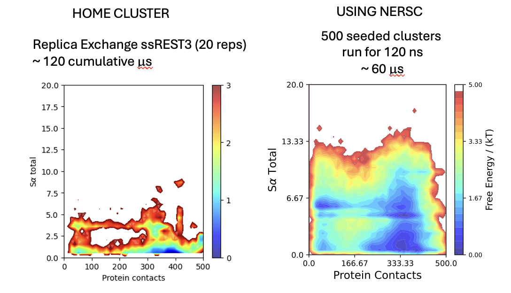

# NERSC_hIAPP

Project Aim: Kinetically and Thermodynamically characterize Dimerization Events
All-atom molecular dynamics simulations of hIAPP on NERSC resources. Scripts and set-up using the a99SB-disp forcefield.
Additional Information is added on how to run several simulations bundled together with seeded conformations. 
* note this assumes that each starting seed is already equilibrated
* the seeds were originally chosen from a replica exchange (REST3) ensemble
* The simulation progress and sampling is evaluated based on the helical content and number of contacts

On the left is shown the simulation progress using replica exchange solute tempering (simulations not carried out on nersc) with a cumulative time of 120 microseconds (~ 2 months time). On the right is shown the simulation progress using seeded simulations of the first generation of FAST using NERSC resources with a cumulative amount of unbiased simulation time of 60 microseconds (2 weeks with bundling). Clearly you can see in less time, using a wide amount of resources, you can achieve a more targeted result. 
